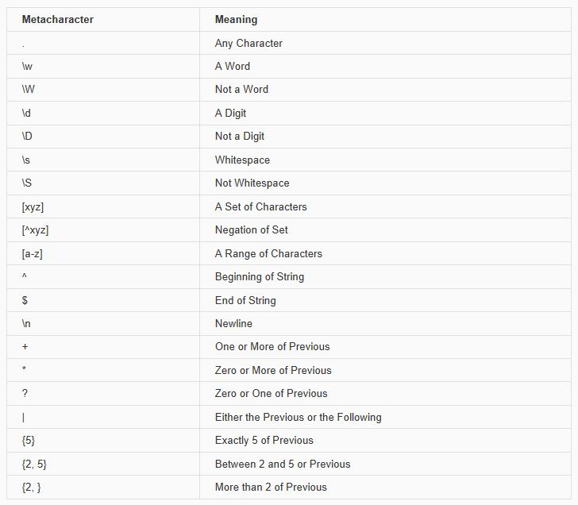

#Text Processing and Regular Expressions

Text in R is represented as a string object, which looks like a phrase surrounded by quotation marks in the R console. For example "Hello!" and 'Strings are fun!' are both strings. You can tell whether an object is a string using the is.character() function. String are also known as characters in R.
You can combine several strings using the paste() function:
```{r}
paste("Square", "Circle", "Triangle")
```
By default the paste() function inserts a space between each word. You can insert a different string between each word by specifying thesep argument:
```{r}
paste("Square", "Circle", "Triangle", sep = "+")
```
A shortcut for combining all of the string arguments without any characters in between each of them is to use the paste0() function:
```{r}
paste0("Square", "Circle", "Triangle")
```
You can also provide a vector of strings as an argument to paste(). For example:
```{r}
shapes <- c("Square", "Circle", "Triangle")
paste("My favorite shape is a", shapes)

two_cities <- c("best", "worst")
paste("It was the", two_cities, "of times.")
```
As you can see, all of the possible string combinations are produced when you provide a vector of strings as an argument to paste(). You can also collapse all of the elements of a vector of strings into a single string by specifying the collapse argument:
```{r}
paste(shapes, collapse = " ")
```
Besides pasting strings together, there are a few other basic string manipulation functions you should be made aware of. The nchar()function counts the number of characters in a string:
```{r}
nchar("Supercalifragilisticexpialidocious")
```
The toupper() and tolower() functions make strings all uppercase or lowercase respectively:
```{r}
cases <- c("CAPS", "low", "Title")
tolower(cases)

toupper(cases)
```
#Text Manipulation Functions in R
Now that we’ve covered the basics of string manipulation in R, let’s discuss the more advanced topic of regular expressions. A regular expression is a string that defines a pattern that could be contained within another string. A regular expression can be used for searching for a string, searching within a string, or replacing one part of a string with another string. In this section I might refer to a regular expression as a regex, just know that they’re the same thing.

Regular expressions use characters to define patterns of other characters. Although that approach may seem problematic at first, we’ll discuss meta-characters (characters that describe other characters) and how you can use them to create powerful regular expressions.

One of the most basic functions in R that uses regular expressions is the grepl() function, which takes two arguments: a regular expression and a string to be searched. If the string contains the specified regular expression then grepl() will return TRUE, otherwise it will return FALSE. Let’s take a look at one example:
```{r}
regular_expression <- "a"
string_to_search <- "Maryland"

grepl(regular_expression, string_to_search)
```
In the example above we specify the regular expression "a" and store it in a variable called regular_expression. Remember that regular expressions are just strings! We also store the string"Maryland" in a variable called string_to_search. The regular expression "a" represents a single occurrence of the character"a". Since "a" is contained within "Maryland", grepl() returns the value TRUE. Let’s try another simple example:
```{r}
regular_expression <- "u"
string_to_search <- "Maryland"

grepl(regular_expression, string_to_search)
```
The regular expression "u" represents a single occurrence of the character "u", which is not a sub-string of "Maryland", therefore grepl() returns the value FALSE. Regular expressions can be much longer than single characters. You could for example search for smaller strings inside of a larger string:
```{r}
grepl("land", "Maryland")
grepl("ryla", "Maryland")
grepl("Marly", "Maryland")
grepl("dany", "Maryland")
```
Since "land" and "ryla" are sub-strings of "Maryland", grepl()returns TRUE, however when a regular expression like "Marly" or"dany" is searched grepl() returns FALSE because neither are sub-strings of "Maryland".

There’s a dataset that comes with R called state.name which is a vector of Strings, one for each state in the United States of America. We’re going to use this vector in several of the following examples.
```{r}
head(state.name)
```
Let’s build a regular expression for identifying several strings in this vector, specifically a regular expression that will match names of states that both start and end with a vowel. The state name could start and end with any vowel, so we won’t be able to match exact sub-strings like in the previous examples. Thankfully we can use metacharacters to look for vowels and other parts of strings. The first metacharacter that we’ll discuss is *".". The metacharacter that only consists of a period represents any character other than a new line* (we’ll discuss new lines soon). Let’s take a look at some examples using the peroid regex:
```{r}
grepl(".", "Maryland")
grepl(".", "*&2[0+,%<@#~|}")
grepl(".", "")
```
As you can see the period metacharacter is very liberal. This metacharacter is most userful when you don’t care about a set of characters in a regular expression. For example:
```{r}
grepl("a.b", c("aaa", "aab", "abb", "acadb"))
```
In the case above grepl() returns TRUE for all strings that contain an *a* followed by any other character followed by a *b*.

You can specify a regular expression that contains a certain number of characters or metacharacters using the enumeration metacharacters. The + metacharacter indicates that one or more of the preceding expression should b present and * indicates that zero or more of the preceding expression is present. Let’s take a look at some examples using these metacharacters:
```{r}
# Does "Maryland" contain one or more of "a" ?
grepl("a+", "Maryland")

# Does "Maryland" contain one or more of "x" ?
grepl("x+", "Maryland")

# Does "Maryland" contain zero or more of "x" ?
grepl("x*", "Maryland")
```
You can also specify exact numbers of expressions using curly brackets {}. For example "a{5}" specifies “a exactly five times,”"a{2,5}" specifies “a between 2 and 5 times,” and "a{2,}"specifies “a at least 2 times.” Let’s take a look at some examples:
```{r}
# Does "Mississippi" contain exactly 2 adjacent "s" ?
grepl("s{2}", "Mississippi")

# This is equivalent to the expression above:
grepl("ss", "Mississippi")

# Does "Mississippi" contain between 1 and 3 adjacent "s" ?
grepl("s{2,3}", "Mississippi")

# Does "Mississippi" contain between 2 and 3 adjacent "i" ?
grepl("i{2,3}", "Mississippi")

# Does "Mississippi" contain between 2 adjacent "iss" ?
grepl("(iss){2}", "Mississippi")

# Does "Mississippi" contain between 2 adjacent "ss" ?
grepl("(ss){2}", "Mississippi")

# Does "Mississippi" contain the pattern of an "i" followed by 
# 2 of any character, with that pattern repeated three times adjacently?
grepl("(i.{2}){3}", "Mississippi")
```
In the last three examples I used parentheses () to create a capturing group. A capturing group allows you to use quantifiers on other regular expressions. In the last example I first created the regex"i.{2}" which matches i followed by any two characters (“iss” or “ipp”). I then used a capture group to to wrap that regex, and to specify exactly three adjacent occurrences of that regex.

You can specify sets of characters with regular expressions, some of which come built in, but you can build your own character sets too. First we’ll discuss the built in character sets: words ("\\w"), digits ("\\d"), and whitespace characters ("\\s"). Words specify any letter, digit, or a underscore, digits specify the digits 0 through 9, and whitespace specifies line breaks, tabs, or spaces. Each of these character sets have their own compliments: not words ("\\W"), not digits ("\\D"), and not whitespace characters ("\\S"). Each specifies all of the characters not included in their corresponding character sets. Let’s take a look at a few examples:
```{r}
grepl("\\w", "abcdefghijklmnopqrstuvwxyz0123456789")
grepl("\\d", "0123456789")

# "\n" this regex for a new line and "\t" is the regex for a tab

grepl("\\s", "\n\t   ")
grepl("\\d", "abcdefghijklmnopqrstuvwxyz")
grepl("\\D", "abcdefghijklmnopqrstuvwxyz")
grepl("\\w", "\n\t   ")
```
You can also specify specific character sets using straight brackets[]. For example a character set of just the vowels would look like:"[aeiou]". You can find the complement to a specific character by putting a carrot ^ after the first bracket. For example "[^aeiou]"matches all characters except the lowercase vowels. You can also specify ranges of characters using a hyphen - inside of the brackets. For example "[a-m]" matches all of the lowercase characters between a and m, while "[5-8]" matches any digit between 5 and 8 inclusive. Let’s take a look at some examples using custom character sets:
```{r}
grepl("[aeiou]", "rhythms")
grepl("[^aeiou]", "rhythms")
grepl("[a-m]", "xyz")
grepl("[a-m]", "ABC")
grepl("[a-mA-M]", "ABC")
```
You might be wondering how you can use regular expressions to match a particular punctuation mark since many punctuation marks are used as metacharacters! Putting two backslashes before a punctuation mark that is also a metacharacter indicates that you are looking for the symbol and not the metacharacter meaning. For example "\\." indicates you are trying to match a period in a string. Let’s take a look at a few examples:
```{r}
grepl("\\+", "tragedy + time = humor")
grepl("\\.", "http://www.jhsph.edu/")
```
There are also metacharacters for matching the beginning and the end of a string which are "^" and "$" respectively. Let’s take a look at a few examples:
```{r}
grepl("^a", c("bab", "aab"))
grepl("b$", c("bab", "aab"))
grepl("^[ab]+$", c("bab", "aab", "abc"))
```
The last metacharacter we’ll discuss is the OR metacharacter ("|"). The OR metacharacter matches either the regex on the left or the regex on the right side of this character. A few examples:
```{r}
grepl("a|b", c("abc", "bcd", "cde"))
grepl("North|South", c("South Dakota", "North Carolina", "West Virginia"))
```
Finally we’ve learned enough to create a regular expression that matches all state names that both begin and end with a vowel:

1. We match the beginning of a string.
2. We create a character set of just capitalized vowels.
3. We specify one instance of that set.
4. Then any number of characters until:
5. A character set of just lowercase vowels.
6. We specify one instance of that set.
7. We match the end of a string.
```{r}
start_end_vowel <- "^[AEIOU]{1}.+[aeiou]{1}$"
vowel_state_lgl <- grepl(start_end_vowel, state.name)
head(vowel_state_lgl)
state.name[vowel_state_lgl]
```




#Regular Expressions

#RegEx Functions in R

#The stringr Package


